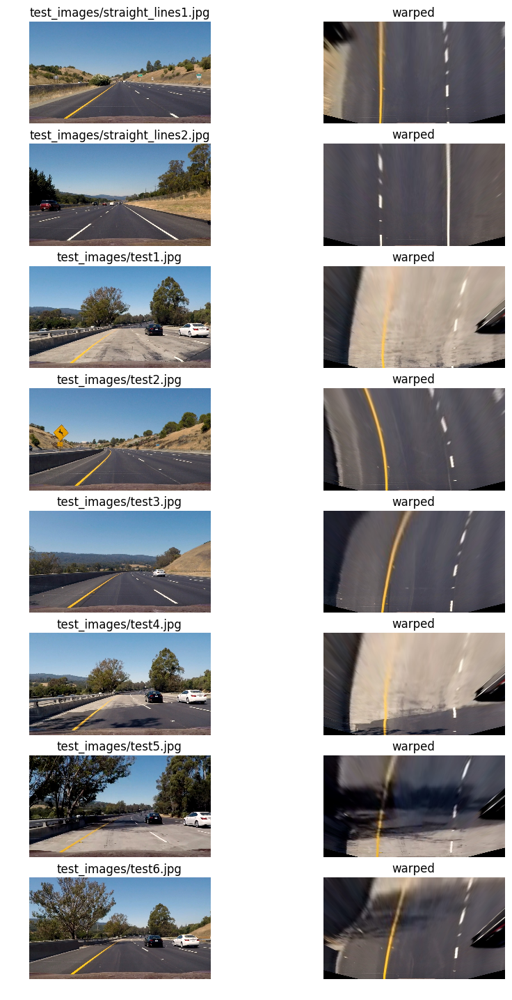

## Advanced Lane Finding

In this project, my goal is to write a software pipeline to identify the lane boundaries in a video.  

Project Breakdown:
---

1. Camera Calibration  
  * Compute the camera calibration matrix and distortion coefficients given a set of chessboard images.

2. Pipeline  
  * Apply a distortion correction to raw images.
  * Use color transforms, gradients, etc., to create a thresholded binary image.
  * Apply a perspective transform to rectify binary image ("birds-eye view").
  * Detect lane pixels and fit to find the lane boundary.
  * Determine the curvature of the lane and vehicle position with respect to center.
  * Warp the detected lane boundaries back onto the original image.
  * Output visual display of the lane boundaries and numerical estimation of lane curvature and vehicle position.

3. Pipeline (video)  

4. Discussion  

1. Camera Calibration: 
---

_Script:_ `myCameraCalibration.py`

To calibrate the camera, I apply the `findChessboradCorners` and `calibrateCamera` functions from `opencv` on 20 9X6-corner chessboard images in `camera_cal`.  **20 is the suggested least number of images to perform a good camera calibration.** I save the found camera calibration matrix and distortion coefficients in a dictionary object and dump it as a pickle file `./output/myCalibration.p`. 

Here is an example of an undistorted chessboard image. 

2. Pipeline: Undistort
---

_Scripts:_ `myLaneDetection.py` (Line 17) 

This is a straightforward step. Once I load my camera calibration matrix and distortion coefficients (Line 19-21 `./output/myCalibration.p`), I make use of `opencv`'s `undistort` function to undistort a lane image.

Here is an example of an undistorted lane image. 

2. Pipeline: Color and Gradient Thresholding
---

_Scripts:_ `myImageProcessing.py` (Line 29-63), `myLaneDetection.py` (Line 20)

I use three sets of thresholding conditions on the original lane color images.  

1. Gradient changes in the x direction between 20 and 100.  
2. S channel values in HLS color channels between 170 and 255.  
3. Yellow and white colors in RGB color channels, where R > 180, G > 180, and B < 155.  

Here are some examples of my binary thresholded images. 

2. Pipeline: Perspective Transform
---

_Scripts:_ `myCameraCalibration.py` (Line 51, 53, 56), `myImageProcessing.py` (Line 67-71)

I handpicked four source points that roughly formed an isosceles trapezoid in the original 3D lane image, labeled with pink crosses below, and defined their destination points on a 2D image plane.   

I confirmed my choices for the source and destination points after all the warped lane images showed somewhat satisfactory parallel lane lines.  

2. Pipeline: Slidng Window Method
---

2. Pipeline: Find Curvature and Position of Car Off-center
---

2. Pipeline: Warping
---

2. Pipeline: Assemble Diagnostic Screen
---

3. Pipeline: Video
---

4. Discussion
---

 
