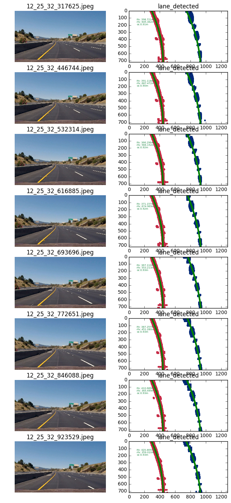
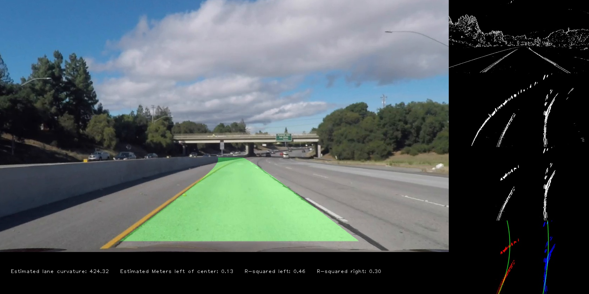
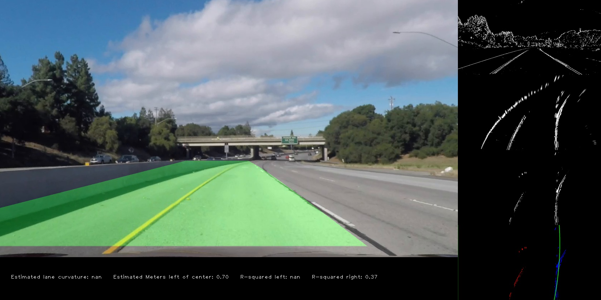

## Advanced Lane Finding
[](http://www.udacity.com/drive)


In this project, my goal is to write a software pipeline to identify the lane boundaries in a video. 

Project Breakdown:
---

1. Camera Calibration  
  * Compute the camera calibration matrix and distortion coefficients given a set of chessboard images.

2. Pipeline  
  * Apply a distortion correction to raw images.
  * Use color transforms, gradients, etc., to create a thresholded binary image.
  * Apply a perspective transform to rectify binary image ("birds-eye view").
  * Detect lane pixels and fit to find the lane boundary.
  * Determine the curvature of the lane and vehicle position with respect to center.
  * Warp the detected lane boundaries back onto the original image.
  * Output visual display of the lane boundaries and numerical estimation of lane curvature and vehicle position.

3. Pipeline (video)  

4. Discussion  

Files and Folders Used In the Project:
---
|Name|Description|
|---|---|
|`/camera_cal`|Chessboard images for camera calibration|
|`/output/calibration.p`|Camera calibration, distortion coefficients, perspective transform matrix and its inverse|
|`/output_images/`|Images used in READ.ME|
|`myCameraCalibration.py`|Code for camera calibration|
|`myImageProcessing.py`|Majority of the functions used for the pipeline|
|`myLaneDetection.py`|Main function of the project that reads in input video and outputs the lane-detected video|
|`myLineComponents.py`|Definition of class `Line`|
|`project_video.mp4`|Raw video, also on [YouTube](https://youtu.be/BhJmE993Mgk)|
|`project_video_output.mp4`|Output video|
|Other files and folders|They either come with the project or are there for testing and sandboxing purposes|

1. Camera Calibration: 
---

_Script:_ `myCameraCalibration.py`

To calibrate the camera, I apply the `findChessboradCorners` and `calibrateCamera` functions from `opencv` on 20 9X6-corner chessboard images in `camera_cal`.  **20 is the suggested least number of images to perform a good camera calibration.** I save the found camera calibration matrix and distortion coefficients in a dictionary object and dump it as a pickle file `./output/myCalibration.p`. 

Here is an example of an undistorted chessboard image. 


2. Pipeline: Undistort
---

_Scripts:_ `myLaneDetection.py` (Line 17) 

This is a straightforward step. Once I load my camera calibration matrix and distortion coefficients (Line 19-21 `./output/myCalibration.p`), I make use of `opencv`'s `undistort` function to undistort a lane image.

Here is an example of an undistorted lane image. 


2. Pipeline: Color and Gradient Thresholding
---

_Scripts:_ `myImageProcessing.py` (Line 33-67), `myLaneDetection.py` (Line 20)

I use three sets of thresholding conditions on the original lane color images.  

1. Gradient changes in the x direction between 20 and 100.  
2. S channel values in HLS color channels between 170 and 255.  
3. Yellow and white colors in RGB color channels, where R > 180, G > 180, and B < 155.  

Here are some examples of my binary thresholded images. 


2. Pipeline: Perspective Transform/Warping
---

_Scripts:_ `myCameraCalibration.py` (Line 51, 53, 56), `myImageProcessing.py` (Line 70-74), `myLaneDetection.py` (Line 23)

I handpicked four source points that roughly formed an isosceles trapezoid in the original 3D lane image, labeled with pink crosses below, and defined their destination points on a 2D image plane.   

src | dst |
---|---|
(595,450)|(400,0)|
(689,450)|(880,0)|
(1060,690)|(880,720)|
(250,690)|(400,720)|


I confirmed my choices for the source and destination points after all the warped lane images showed somewhat satisfactory parallel lane lines.  


2. Pipeline: Finding Lane Pixels
---

_Scripts:_ `myImageProcessing.py` (Line 78-271), `myLaneDetection.py` (Line 26-27)

This is the part of the project where I have spent most time on because it is challenging to always detect lane lines correctly. I rely on five functions to do my job properly. Here is roughly how they work. Detailed comments can be found in the scripts.  

|Function|Description|
|---|---|
|`findLanePoints`|This is where the main logic of my approach sits. If a lane is not detected in the previous frame, use a sliding window method. If a line is detected, use a masking method. |
|`maskingMethod`|Use the last fitted lane line to create a region of interest and mask the thresholded image to find lane points.|  
|`slidingWindowMethod`|Use histograms and sliding windows to search for lane points from the bottom of an image to the top.| 
|`find_lane_start`|Supports `slidingWindowMethod`, calculate where to start the search.|
|`update_mx_from_histogram`|Also Supports `slidingWindowMethod`, calculate and update the new midpoint on the x-axis for the next bounding box.|

The warped image from the previous step gets passed to my `findLanePoints` function. It decides whether to use a sliding window method or a masking method on this warped image based on whether lanes have been detected in the previous frame.  

With the **sliding window method**, the default sliding window size is (128, 72). If both the left and right lane lines are detected in the previous frame, searching of lanes in the current frame starts where the lanes in the previous frame start.  In all other cases, if only one lane was detected and not the other in the previous frame, I set the starting point of my search for the detected lane where the previously found lane is, and use a custom function to locate a good starting point for my search; if neither lanes were detected in the previous frame, a full-blown search gets kicked off.  

I will explain `find_lane_start` next before I come back to `sliding_window_method`. `find_lane_start` gets passed the histogram information of the lower half of a warped lane image. It first tries to look for peaks that have a value greater than 4,500 pixels and a wavelength of (50, 100) pixels on the left and right panels. The latter is done using `scipy.signals.find_peaks_cwt`. If those peaks are found, I then assume that that true lane lines are the ones that are closer to the center line. If those peaks are not found, perhaps my criteria are too strigent for certain cases, and I will resort to simply finding the x-coordinates of the pinnacles in the histogram.  

With information of where to start the search for the lane lines, I can draw my very first two sliding windows. In cases where the lanes are present in the first two sliding windows, the search moves upward, adjusting their positions based on where there is a higher concentration of pixels. However, there may still be cases where nothing is detected in the sliding windows, or they are in the wrong positions. For now, I can let that be. This can later be fixed in my custom function `findCurvature`.

During the search, I use standard deviation - which is tied to variance - to decide if what I see in a sliding window gives me good intel about the presence of a lane line. As I have noticed, points can spread every which way in certain sliding windows. This would force `signal.find_peaks_cwt` to analyze a flat line, resulting in very inaccurate suggestions of lane lines. Since I only feel confident to shift my sliding windows left and right when there is clear indication of a clean lane line, I set a condition to the standard deviation value of the pixels in the sliding window. Noisy dots results in very small variance/standard deviation, and clear lane lines results in very large variance/stardard deviation. Through trial and error, I found that 1000 for stardard deviation worked very well.  

With the **masking method**, things are a lot more straightforward, I simply use the fitted x from the previous frame, create a band of width 64 pixels to the left and right of it, and draw two polygons, one for each lane. Overlaying the polygons with the original warped image isolates lane points for the current frame.  

Here are some examples of my detected lane lines using the **sliding window method**.  


2. Pipeline: Find Curvature and Position of Car Off-center
---

_Scripts:_ `myImageProcessing.py` (Line 298-447), `myLaneDetection.py` (Line 30-31)

My `findCurvature` function can be broken down into three larger steps:  

1. Gather the x and y coordinates of the pixels belonging to each lane, update them accordingly in my Line class object.  
2. Determine the fitted x for each lane, update `fx`, `detected`, `bestx`, `coeffs`, and `best_fit` in my Line class object for each lane.  
3. Calculate curvature, r squared, and offcenter in meters.  

Step 1 is straightforward except in cases where there are too few points to fit a polynomial. When that happens, I use the previous frame's fitted x for those problematic lanes.  

Step 2 has quite some conditions built in to check if the detected curvature is actually correct. If previous frame's information is available, not only do I check that the standard deviation of the absoluate difference between the current fitted x and the previous fitted x is less than 20, I also make sure that less than one sixth of the differences between the left lane and right fall outside the range `5.5/16 * 1280` and `7/16 * 1280`. A small variance/standard deviation means that the fitted x for the left and right lane is distributed rather evenly, without unwanted parts that are way too wide or way too narrow.  

`
if np.std(abs(left_fitx - L.fx[-1])) < 20 and np.std(abs(right_fitx-R.fx[-1])) < 20 and \
   np.sum((right_fitx-left_fitx) < w*(5.5/16)) + np.sum((right_fitx-left_fitx) > w*(7/16)) < h/6:
` 


When the distance between my left and right lane pixels do not pass muster with my criteria, I go on to determine which one of them is a better one to trust and **offset it by the average width of the road in the past five frames** to find the other lane. To do this, I compare my fitted x for each lane with the previous frame's fitted x, whichever lane with a smaller standard deviation/variance gets considered first, if the fit shows a reasonable r squared value between 0 and 1 and has a R squared value greater than the other lane fit's R squared value. My other lane is calculated from the found lane using an offset value, which is the road widths from the previous frame. If, however, the other lane fit has a reasonable R squared, as well as reasonal starting and ending points not too far away from those points from the previous frame, I make the exception and use it. This takes care of cases where my criteria are too strigent for a correct lane detected.  

```
            # If the left lane is a better fit with conditions:
                # 1. smaller standard deviation comparing current fitted x with previous best fitted x
                # 2. better r squared than the other
                # 3. r squared is reasonably good 
            if np.std(abs(left_bestx - left_fitx)) < np.std(abs(right_bestx - right_fitx)) and \
            lr2 > rr2 and lr2 <= 1 and lr2 >= 0:
                
                L.fx.append(left_fitx)
                L.detected = True
                L.coeffs = left_fit
                L.best_fit.append(L.coeffs)
            
                # despite everything, if any of the conditions below is true, don't use it
                # 1. r squared is not reasonable
                # 2. offset by more than 64 pixels on either end of the fitted lanes 
                if rr2 > 1 or rr2 < 0 or abs(right_fitx[0] - R.fx[-1][0]) > 64 or \
                abs(right_fitx[-1] - R.fx[-1][-1]) > 64:
                    R.fx.append(left_fitx - w_road)
                    rightx = R.fx[-1]; righty = y_arr
                    R.detected = False
                # else, use it. 
                else: 
                    R.fx.append(right_fitx)
                    R.detected = True
```  


Step 3 makes use of the code snippets available in the coursework to calculate curvature in radius. I calculate my offcenter by extracting the lowest x coordinates on both lanes, average them, compare them to the midpoint of the frame, and scale the distance between the two in meters. Positive offcenter values suggest that the car is slightly to the right of the center line of the frame, and negative values suggest that the car is slightly to the left of the center line.  

`
offcenter = ((R.fx[-1][-1]+L.fx[-1][-1])/2-w/2)*(3.7/(w*(6/16)))
`

I sliced and diced my code to create the visual below (details in `./archive/myDiagosis-Copy1.ipynb`). A sequence of eight images as they occur in the video are selected and curvature and offcenter calculation were performed on them.  



2. Pipeline: Unwarping
---

_Scripts:_ `myImageProcessing.py` (Line 381-398), `myLaneDetection.py` (Line 36)

This step makes use of the detected lanes in the previous step as well as the inverse of the perspective transform matrix `Minv` to unwarped the image. 


2. Pipeline: Assemble Diagnostic Screen
---

_Scripts:_ `myImageProcessing.py` (Line 464-480), `myLaneDetection.py` (Line 39-41)

Thanks to [John Chen's suggestion of making a diagnostic screen](https://goo.gl/j0LZnS) in the class forum, I also stacked different stages in my pipeline into a diagnostic screen.  


3. Pipeline: Video
---

On YouTube (new one): https://youtu.be/BhJmE993Mgk  

In here: `project_video_output.mp4`  

On YouTube (old one): https://youtu.be/bAOgVgrM5Y8

4. Discussion 
---

(Dated: Feb. 5, 2017)
This is just an update from two days ago using an improved pipeline. There is some slight improvement, but there still remains a lot to be done. 

 

(Dated: Feb. 3, 2017)
*I already know that my pipeline could fail on the harder challenge video because of the way I define my left and right lane pixels. Right now, I have it set up so that any detected lane pixels on the left pane of the image belong to my left lane, and the same for the my right lane.* This, however, won't be true for that video, where the lanes should shift panes when the road comes to a sharp bend.  

I can address this problem by masking a region of interest (ROI) based on lanes found in the previous frames. That way, my left lane could cross into the right pane, and my right lane left, and I could also avoid using a sliding window search.  

I tried my code on the first challenge video. *Judging from the result, I realized that my pipeline would need a good first frame to kickstart things properly.* In the diagnostic screen below, the lane line pixels colored red and blue don't look too bad, but the right fit is curving in the wrong direction (because of a white blob on the very top of the image), and my left lane went all the way to edge of the perspective transformed image. This is due to `nan` values of my best fitted x, which is absent for the first frame.  

  

After I fixed that issue, more other issues came up. For instance, the width of the road seemed narrower than the project video, and the difference in the cement of the road confused my model as to which lane line shall be trusted. The only ways I can think of now to fix that are perhaps, first, re-do my camera calibration and make sure the road widths don't vary too much from one road to another road, then, re-experiment with different thresholding criteria, and lastly, instead of averaging over the past five frames, try more frames.  

*After-thought: This is the first time that I have ever employed python Class objects in a project. I had to make it work by creating some global variables. There must be other better ways to do it that I'm not aware of. I'm glad that I got everything to work as I needed them to for the project video so I can wrap up for now. But I will keep an eye out for how others accomplish similar tasks by using those class objects differently!*
